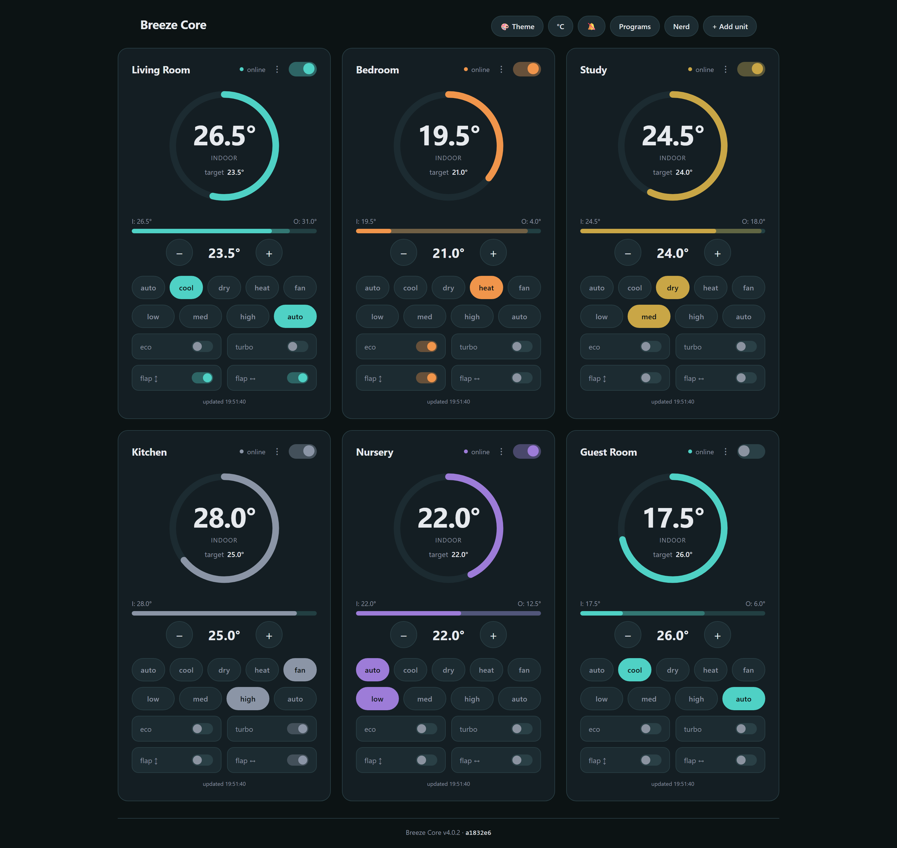

<div align="center">

# Breeze Core

**Your air conditioner. Your network. No cloud.**

Self-hosted control for Midea air conditioners — a REST API, a web panel, and a
native Android app that talk to your units over your own LAN.

[](LICENSE)
[](https://github.com/monikapurpl3/breeze-core-native/releases/latest)
[](https://aspic.salataputarica.hr.eu.org)
[](https://github.com/monikapurpl3/breeze-core-native/wiki)

</div>



## Why

The vendor app sends "make it 23°" to a datacentre and back, to reach a machine
three metres away. Breeze Core cuts the round trip: after one local pairing
there is **no cloud dependency, no account, and no telemetry**. When your
internet is down, your air conditioning still works.

- **Control it from anywhere on your LAN** — browser, Android app, home-screen
  widgets, Android Auto, REST, `curl`, cron.
- **Automation that runs on the server.** Schedules and temperature curves fire
  whether or not your phone is home, charged, or awake.
- **Live, not polled.** Changes push to every client over SSE — yours, a
  schedule's, or another device's.
- **Quiet by default.** The beep is off unless a client asks for it, so a 3 a.m.
  setpoint change wakes nobody.
- **One credential per device**, each individually revocable, each approved from
  the LAN. No shared password to pass around the household.
- **Installs like software should** — a signed repository and native packages
  for Linux, Windows, the BSDs, Void, Gentoo, OpenWrt and OPNsense, plus
  container images.

It is **one static executable of about 2.5 MB with no dependencies at all** —
not few, none — which is why it fits as comfortably on a router as on a server.

## Install

**Linux** — add the signed repository and updates arrive through your package
manager:

```bash
curl -fsSL https://aspic.salataputarica.hr.eu.org/aspic.asc \
  | sudo gpg --dearmor -o /usr/share/keyrings/aspic.gpg
echo "deb [signed-by=/usr/share/keyrings/aspic.gpg] https://aspic.salataputarica.hr.eu.org/deb stable main" \
  | sudo tee /etc/apt/sources.list.d/aspic.list
sudo apt update && sudo apt install breeze-core

sudo breeze-core pair                      # finds your units, writes the config
sudo systemctl enable --now breeze-core    # start it, survives reboots
```

Then open `http://<server>:8420` and enter the key it printed.

**Everything else** —
[Windows](https://github.com/monikapurpl3/breeze-core-native/wiki/Installing-on-Windows)
· [containers](https://github.com/monikapurpl3/breeze-core-native/wiki/Installing-with-containers)
· [OPNsense](https://github.com/monikapurpl3/breeze-core-native/wiki/Installing-on-OPNsense)
· [the BSDs](https://github.com/monikapurpl3/breeze-core-native/wiki/Installing-on-the-BSDs)
· [Void, Gentoo and the other package managers](https://github.com/monikapurpl3/breeze-core-native/wiki/Installing-from-packages)
· [macOS and from source](https://github.com/monikapurpl3/breeze-core-native/wiki/Installing-from-source)
· [one-off downloads](https://aspic.salataputarica.hr.eu.org)

**Android app** — [Breeze](https://github.com/monikapurpl3/breeze), with widgets
and Android Auto.

**Already running an earlier version?**
[Upgrading to 4.x](https://github.com/monikapurpl3/breeze-core-native/wiki/Upgrading-to-4)
is one command, and your units, key, paired phones and programs all stay where
they are.

## Documentation

Everything lives in the **[wiki](https://github.com/monikapurpl3/breeze-core-native/wiki)**:

|  |  |
|---|---|
| [First run and pairing](https://github.com/monikapurpl3/breeze-core-native/wiki/First-run-and-pairing) | getting from installed to controlling |
| [The web panel](https://github.com/monikapurpl3/breeze-core-native/wiki/The-web-panel) · [Programs, schedules, curves](https://github.com/monikapurpl3/breeze-core-native/wiki/Programs-schedules-and-curves) · [Timers](https://github.com/monikapurpl3/breeze-core-native/wiki/Timers) | using it day to day |
| [REST API](https://github.com/monikapurpl3/breeze-core-native/wiki/REST-API) · [Control schema](https://github.com/monikapurpl3/breeze-core-native/wiki/Control-schema) · [Configuration](https://github.com/monikapurpl3/breeze-core-native/wiki/Configuration) | writing a client, automating it |
| [Exposing it safely](https://github.com/monikapurpl3/breeze-core-native/wiki/Exposing-it-safely) · [Reverse proxy and TLS](https://github.com/monikapurpl3/breeze-core-native/wiki/Reverse-proxy-and-TLS) | reaching it from outside the house |
| [Troubleshooting](https://github.com/monikapurpl3/breeze-core-native/wiki/Troubleshooting) | when something is off |
| [Architecture](https://github.com/monikapurpl3/breeze-core-native/wiki/Architecture) · [Building and releasing](https://github.com/monikapurpl3/breeze-core-native/wiki/Building-and-releasing) · [Ports and architectures](https://github.com/monikapurpl3/breeze-core-native/wiki/Ports-and-architectures) | working on it |
| [Version history](https://github.com/monikapurpl3/breeze-core-native/wiki/Version-history) | what each release actually gave you |

## Honest limits

It needs a machine that is always on, and you are its sysadmin. Units join Wi-Fi
through the vendor app, and V3 units need **one** internet-connected discovery
run to fetch their credentials — everything after that is offline. Nothing is
exposed to the internet by default; away-from-home control means a VPN or a
proxy you secure yourself. The feature ceiling is your firmware's. The native
app is Android-only. It is one brand, one job — not a home-automation platform.

The full comparison with the vendor app, drawbacks included:
[Compared to NetHome Plus](https://github.com/monikapurpl3/breeze-core-native/wiki/Compared-to-NetHome-Plus).

## Security

Two credentials, never one: an enrolment key to *begin* pairing, and a
per-device credential to use the API. **Ed25519 request signing** is available,
with the secret never on the wire, and can be made mandatory. Admin actions are
gated to the LAN unconditionally — there is no setting to turn that off — with
strict security headers and no interactive docs to leak a schema.

Before exposing anything to the internet, read
**[Exposing it safely](https://github.com/monikapurpl3/breeze-core-native/wiki/Exposing-it-safely)**.

Found a vulnerability? [SECURITY.md](SECURITY.md) — privately, please.

## Licence

[AGPL-3.0-or-later](LICENSE).

The protocol layer is a reimplementation informed by
[msmart-ng](https://github.com/mill1000/midea-msmart) (MIT) and its test
vectors, and by [MideaUART](https://github.com/dudanov/MideaUART) for the
temperature encoding.
